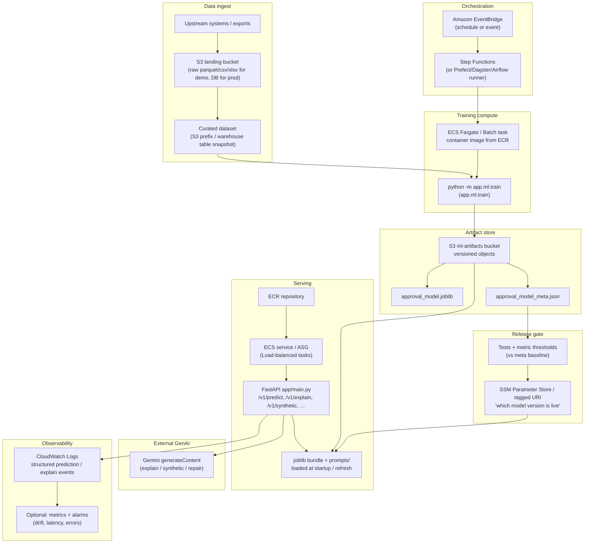

# Design document — GenAI-powered claim approval agent

This is the **single consolidated** write-up for architecture, implementation, deployment, and evaluation. Narrower references: feature rationale in [`docs/FEATURE_ENGINEERING.md`](docs/FEATURE_ENGINEERING.md), AWS service sketch in [`docs/AWS_DEPLOYMENT.md`](docs/AWS_DEPLOYMENT.md), and structured logging shapes in [`docs/PRODUCTION_ARCHITECTURE.md`](docs/PRODUCTION_ARCHITECTURE.md). Executable walkthroughs live in `notebooks/` (summarized below).

---

## 1. Architecture confirmation

The following **end-to-end production diagram** matches the intended AWS-shaped deployment and is **consistent with this repository**:

- **Data**: upstream exports → **landing** (S3 raw parquet/CSV/XLSX for demos; warehouse/DB in prod) → **curated** snapshot used for training.
- **Orchestration**: **EventBridge** (schedule or event) drives **Step Functions** (or Prefect/Dagster/Airflow) to launch training.
- **Training**: **ECS Fargate** or **Batch** runs a container (**ECR**) executing `python -m app.ml.train` (`app.ml.train`), reading curated data and writing **versioned** `approval_model.joblib` + `approval_model_meta.json` to an **ml-artifacts S3 bucket**.
- **Release gate**: automated **tests and metric thresholds** (vs metadata baseline) promote a **Parameter Store** (or tagged URI) that records **which model version is live**.
- **Serving**: **ECS service** (or ASG) behind a load balancer runs **FastAPI** (`app/main.py`: `/v1/predict`, `/v1/explain`, `/v1/synthetic`, `/v1/repair-text`, …). Tasks **load** the joblib bundle + `prompts/` at startup or on refresh, keyed off the promoted pointer.
- **GenAI**: production calls **Google Gemini `generateContent`** (see `app/config.py`); optional OpenAI-compatible path exists but is secondary.
- **Observability**: **CloudWatch Logs** (and optional metrics/alarms) capture structured **prediction** and **explain** events from the API.

**Local / demo entrypoints** (not drawn on the diagram): **`streamlit run streamlit_app.py`** for interactive use; **`uvicorn app.main:app`** for the REST façade—both use the same ML bundle and GenAI stack.

**Logical runtime stack (what the code actually does):**

| Layer | Implementation |
|--------|----------------|
| ML | sklearn `Pipeline` (`ColumnTransformer` + `RandomForestClassifier`), optional `RandomizedSearchCV` (ROC-AUC); artifacts under `artifacts/` |
| GenAI | Prompt files in `prompts/`; **Gemini** HTTP API with deterministic **offline stubs** when no API key |
| API | FastAPI routes in `app/main.py` |
| UI | Streamlit front-end sharing inference helpers |

---

## 2. Claim approval ML (modelling)

### 2.1 Problem framing

- **Label**: `status` in `claim_use_case_dataset.xlsx` → **approved = 1** if `Completed`, **0** if `Declined` (completion vs decline as in the README).
- **Goal**: probabilistic approval with transparent drivers for downstream GenAI—not maximizing leaderboard accuracy alone.

### 2.2 Evidence-driven features (Notebook 01 + 02)

Notebook **`01_load_and_explore_data`** motivates features with **chi-square / Cramér’s V**, correlations, and Holm–Bonferroni-corrected pairwise tests. Condensed findings (full tables in the notebook and in `docs/FEATURE_ENGINEERING.md`):

- **Money**: weak linear correlation with approval overall; **`rrp`** (binned) and **`excessFee`** tiers still show **non-trivial** categorical association—retained with **`log1p`** stabilizers and ratios such as **`fee_to_rrp`** and **`rrp_minus_balance`**.
- **`deviceCost`**: zero variance in the sample—**dropped**; **`rrp`** proxies device value.
- **Policy span**: exact duration days weak; **`coverage_duration_tier`** (6m/12m/24m-style bands) significant at modest effect size—**engineered** in `app/ml/features.py`.
- **Categoricals**: **`model`** shows stronger association; **`claimType`**, **`channel`**, **`coverage`** weaker at aggregate level but kept for coverage and latent slices.
- **Symptoms**: **`touchScreen`** and **`audio`** stand out; others bundled as **`symptom_count`** and flags.
- **Text**: raw **`issueDesc`** / **`productDesc`** are heavy-tailed; the **tree** uses **length** features (`issue_desc_len`, …) so training stays stable. Notebook 01 also uses **Gemini** for batched translation of `issueDesc` for EDA—not all of that signal is in the default RF pipeline (see feature doc for the separation between “model features” and “LLM repair”).

Notebook **`02_feature_engineering`** validates that **`load_claims_training_frame`**, **`engineer_features`**, and the fitted preprocessor shapes match training expectations.

### 2.3 Training and baselines (Notebook 03)

- **Entrypoint**: `python -m app.ml.train` (`app/ml/train.py`). **`--no-tune`** skips `RandomizedSearchCV` for fast CI and notebooks; full runs tune forest hyperparameters on **ROC-AUC** with **`class_weight="balanced_subsample"`** for label skew (~84% approved in sample).
- **Holdout**: stratified split; metrics persisted in **`approval_model_meta.json`** (`roc_auc`, `accuracy`, `f1`, plus **`classification_report`**-style detail in logs).
- **Baseline**: **`DummyClassifier(strategy="most_frequent")`** as a **no-skill** comparator—if the forest is barely above this, the problem is likely noisy or weakly identified (called out in notebook commentary).

### 2.4 Justification summary (ML)

| Choice | Why |
|--------|-----|
| Random forest in a single `Pipeline` | Handles mixed types, nonlinearities, and **calibrated-enough** probabilities for risk bands without a heavy ops story for this prototype |
| Median imputation + scaling (numeric); OHE with `infrequent_if_exist` | Robust to skew and high-cardinality categoricals |
| Optional search | Demonstrates hyperparameter thinking without blocking CI |
| JSON metadata beside joblib | Cheap **model lineage** (timestamp, seed, metrics, git SHA) for gates and monitoring |

---

## 3. Generative AI

### 3.1 Multi-persona explanations (Notebook 04 + API `/v1/explain`)

- **Mechanism**: `explain_personas` assembles **(1)** a global system prompt (`explain_system.txt`) to forbid invented statutes/amounts, **(2)** **persona conditioners** (e.g. customer vs claims adjuster tone/level of detail), and **(3)** a **grounded JSON payload**: claim fields, **`approved`** / **`probability_approved`**, **risk band**, and **global feature importances** from the forest (`top_feature_names`).
- **Concurrency**: async Gemini calls; with **`GEMINI_RPM`** set, client-side spacing applies between request starts (see `app/genai/gemini.py`). Notebook 4 documents **`async`** / **`await`** usage in Jupyter.
- **Fallback**: without **`GEMINI_API_KEY`**, **deterministic stubs** keep demos and CI green.

This satisfies the challenge’s **multi-persona** requirement with an explicit **prompt strategy**: guardrails + persona + structured model evidence (not free-form speculation).

### 3.2 Targeted synthetic scenarios (Notebook 05 + API `/v1/synthetic`)

Notebook **`05_mock_incremental_data`** formalizes **active learning–style** targeting:

- **Imbalance** and **edge cases** motivate synthesizing **sparse decline** and **borderline** strata.
- **Strata**: cross-tab of `claimType` × `coverage` × `channel` × **`fee_to_rrp` tertile** × **`coverage_duration_tier`**. **`probability_approved`** for “borderline” is **not** in raw ops data—it is **computed** by re-scoring rows with the trained pipeline so “border” means **model ambiguity** (default band **0.40–0.60**, analyst-chosen).
- Tables rank **rare declines**, **rare border-density**, and **high lift_decl** cells; excerpts feed the LLM so prompts describe **where** the portfolio is thin.
- **Caveats** (in notebook): rarity is **operational** (support thresholds, head(k)), not a significance test; post-gen checks can re-run **`predict_batch`** on synthetic rows.

API **`/v1/synthetic`** uses `synthetic_generation.txt` to demand **JSON-array** structured + narrative output, with emphasis on **`denial_patterns`** and **`borderline`** stress—aligned with the notebook methodology.

### 3.3 Text repair (`/v1/repair-text`)

Separate from prediction: **deterministic cleanup** plus optional **Gemini JSON** rewrite for messy text (`app/genai/text_repair.py`)—useful for intake quality without silently changing scores unless the user applies repaired text back into the claim.

### 3.4 Services and cost

- **Primary**: **Google AI Studio / Gemini** (`generateContent`), configurable model id and **RPM / min-interval** env vars (see `README.md` and `.env.example`).
- **Optional**: OpenAI-compatible client when Gemini is not configured.
- **LLMOps hooks**: rate limits, retries on 503, batch sizing for offline eval (`scratch/generate_eval_logs_genai.py`), and logging latencies on explain paths.

---

## 4. Deployment and MLOps / LLMOps

### 4.1 AWS choices (cost, scale, operability)

| Concern | Preferred pattern | Rationale |
|---------|-------------------|-----------|
| Online API | **ECS Fargate** + **ALB** | Same long-lived Uvicorn process as local dev; avoids Lambda payload/cold-start pain for wide claim JSON and batched explanations |
| Images | **ECR** | Immutable digests paired with model metadata SHA |
| Artifacts | **S3 versioning** | Rollback for `joblib` + `meta.json` + optional prompt prefixes |
| Secrets | **Secrets Manager** / SSM | **`GEMINI_API_KEY`**, future DB URLs |
| IaC | **Terraform** stub under `infra/terraform` | Extend to full VPC + ECS + ALB |

Alternatives noted in `docs/AWS_DEPLOYMENT.md`: **Lambda + container** for spiky minimal scale, **App Runner** for simplest public HTTPS, **SageMaker** if training moves to managed notebooks/Processing.

### 4.2 CI/CD (implemented)

**`.github/workflows/ci.yml`** on push/PR:

1. Install deps and **editable** package.
2. Assert workbook presence; **`python -m app.ml.train --no-tune --seed 42`**.
3. **Ruff** on `app` / `streamlit_app.py` / `tests`.
4. **Pytest** with **`DISABLE_PROMETHEUS=1`** where needed.
5. Upload **`artifacts/*.joblib`** and **`artifacts/*.json`** as workflow artifacts.
6. **Docker build** + smoke **`/health`** on the API image.

This demonstrates **repeatable training + test + image** promotion; production would add environment-specific deploy, canaries, and **SSM** pointer updates after **`GATES`** in the architecture diagram.

### 4.3 Versioning

- **Models**: `approval_model_meta.json` records metrics, params, sklearn version, git commit, row counts—used as the **baseline** for promotion checks and monitoring.
- **Prompts**: git-reviewed changes under `prompts/`; `/v1/model/info` lists manifests; optional S3 sync on release tags.

---

## 5. Evaluation, monitoring, and responsible AI

### 5.1 Notebook 06 — offline evaluation harness

**`06_evaluation_and_monitoring`** implements a **timeline** narrative:

1. **T0**: load **ground-truth baseline** metrics from **`approval_model_meta.json`** (not recomputed ad hoc).
2. **T1**: **feature** and **prediction drift** using CSV snapshots—historical vs a **synthetically drifted** “live” slice (e.g. inflated `rrp` / `excessFee` in `scratch/generate_eval_logs_genai.py`).
3. **GenAI**: logs **customer** + **claims_adjuster** explanations per row for **text drift** proxies (e.g. embedding similarity / lexical stats in the notebook).
4. **Golden set / canary**: pattern for holding out labeled rows to catch **immediate** post-deploy regression.

**Production parity**: FastAPI emits **two** JSON-line event kinds via std logging (**`prediction`**, **`explain`**) with shared **model lineage** fields—see `docs/PRODUCTION_ARCHITECTURE.md`. The notebooks’ **`eval_*_logs.csv`** files are **offline** analogs with richer columns for ML + GenAI joint analysis.

### 5.2 Metrics

| Domain | Examples |
|--------|----------|
| ML | ROC-AUC, accuracy, F1, slice metrics by region/tier, **PSI**-style drift on inputs or scores |
| GenAI | Rubric/human spot checks, refusal spikes, **malformed JSON** rate on synthetic, latency |
| System | p95 latency, 5xx, LLM **429/402**, ECS CPU/memory |

### 5.3 Responsible AI

- **Transparency**: narratives **grounded** in model outputs + importances; disclaimers in persona copy for customers.
- **Fairness**: slice monitoring (e.g. `country`, `coverage_duration_tier`) recommended before any automated decisioning—this prototype **predicts for explanation demos**, not autonomous adjudication.
- **Human in the loop**: adjuster-facing persona explicitly flags **fraud/heuristic** follow-ups (see notebook 04 sample outputs).

---

## 6. Assumptions and alternatives

| Assumption | Alternative |
|------------|-------------|
| Single workbook snapshot for training | Warehouse export + partition keys; **Delta/Iceberg** for incremental retrains |
| Gemini for hosted LLM | Amazon Bedrock, Azure OpenAI, on-prem—swap client; keep prompt files |
| Global feature importances vs per-row SHAP | **TreeExplainer** for local attributions if audit requires them |
| No full MLflow registry | Add registry + URI in `approval_model_meta.json` for enterprise traceability |

---

## 7. Notebook index (evidence trail)

| Notebook | Role |
|----------|------|
| `01_load_and_explore_data` | EDA, statistical associations, text translation for analysis |
| `02_feature_engineering` | Validates engineering + preprocessor contract |
| `03_train_model` | Documents CLI/subprocess training and metadata interpretation |
| `04_inference_and_genai` | `predict_batch`, importances, **multi-persona** GenAI |
| `05_mock_incremental_data` | **Targeted synthetic** prompting from sparse strata |
| `06_evaluation_and_monitoring` | Drift + GenAI quality proxies + artifact baselines |

Regenerate pipeline notebooks 01–04 after editing steps: `python scripts/emit_pipeline_notebooks.py`.

---

## 8. Implemented vs stretch goals

| Item | Status |
|------|--------|
| ML pipeline + tuning + baselines | Implemented |
| Multi-persona + synthetic GenAI + stubs | Implemented |
| FastAPI + Streamlit + Docker + CI | Implemented |
| Structured logs + optional Prometheus | Implemented |
| Full Terraform prod stack + canary deploy | Stub / documented only |
| SHAP per claim + MLflow + automated drift alarms | Described; not fully wired |

---

*This prototype is illustrative; regulated claim decisions require jurisdictional controls beyond this repository.*
