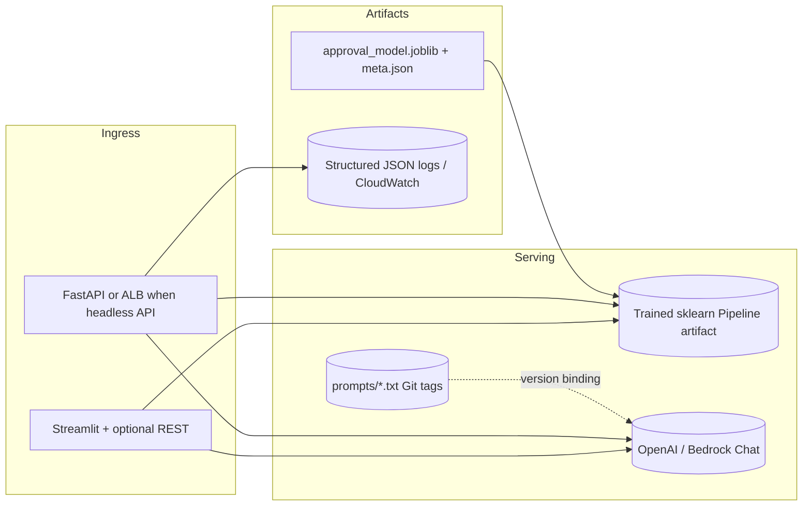

# Design Document — Claim Approval Agent Prototype

## 1. High-level architecture

Interactive users run **`streamlit run streamlit_app.py`** for forms, charts, personas, and optional synthetic vignettes (same backends as the REST façade). Optionally, clients still call **`/v1/predict`** / **`/v1/explain`** when running `uvicorn` for tabular scoring and LLM explanations with **prediction + calibrated risk band + global feature-importance snapshot** grounded in `prompts/`.

## 2. Component responsibilities

### 2.1 ML path

Training data **`claim_use_case_dataset.xlsx`** maps **`approved = 1` when `status == Completed`** and **`0`** for **`Declined`**. Rows are engineered in `app/ml/features.py`:

- Monetary fields retain raw euros plus **`log1p`** copies; textual merchandising fields derive **length** features; policy/purchase deltas become **elapsed-day** surrogates.
- Categorical facets (`coverage`, `claimType`, `productCode`, …) funnel through **`OneHotEncoder`** with **`infrequent_if_exist`** for rare categories.

Serving reuses the same preprocessing (`app/ml/inference_inputs.py`). Artifacts serialize the **fitted `Pipeline`**.

Hyperparameters optionally come from **`RandomizedSearchCV`** (ROC-AUC scoring, `balanced_subsample` forest weights); CI/local demos pass **`--no-tune`** for speed.

Artifacts write:

- **Model bundle**: `approval_model.joblib` (`pipeline` + mirrored training metadata envelope).
- **Metadata**: `approval_model_meta.json` (training timestamp, sklearn version, metrics, repo commit hash).

### 2.2 GenAI path

Explanation assembly uses **three tiers**:

1. **Global guardrails**: `explain_system.txt` forbids hallucinated statutes/amounts/notices.
2. **Persona conditioners**: Separate prefix files constrain tone (**customer**) vs (**claims adjuster**).
3. **Grounding payload**: Serialized claim JSON + calibrated probability + aggregated decision band + truncated tree importances sourced from sklearn `get_feature_names_out()`.

Synthetic generation prompts (`synthetic_generation.txt`) force **`JSON-array` output**, scenario targets (`denial_patterns` emphasizing late FNOL, priors clash, inconsistent police flagging; `borderline` near calibrated thresholds).

### 2.3 API surface (`app/main.py`)

| Route | Behavior |
|-------|-----------|
| `GET /health` | Liveness for ALB/Target Group |
| `GET /v1/model/info` | Surfaces persisted training metrics + enumerated prompt manifests |
| `POST /v1/predict` | ML-only inference + lightweight template synopsis |
| `POST /v1/explain` | Predict + persona text (LLM parallelized per persona) |
| `POST /v1/synthetic` | LLM-produced JSON-array of structured+narrative stress cases |

## 3. AWS deployment blueprint (preferred target)

Goal: horizontally scalable **stateless** container + managed LLM egress + durable artifact lineage.

### 3.1 Compute

- **`AWS Fargate` on `ECS`** (fronted by **`Application Load Balancer`**) hosts FastAPI replicas (CPU-heavy ML + bursty GPU-less LLM API calls acceptable if OpenAI-hosted). Autoscaling metrics: ALB latency + CPU + custom LLM backlog depth.
- **Alternative slim mode**: **`API Gateway`** + **`Lambda`** packaged with **container image** (~512MB–1500MB zipped dependencies) suitable for intermittent loads; caveat: cold-start & package size budgeting.

### 3.2 Storage / networking / secrets

- **Artifacts**: **`S3` bucket** versioning for `approval_model.joblib` + manifests; runtime downloads on boot or attaches via ECS task ephemeral cache with integrity hash check.
- **Prompts**: **Git tagging** mirrored to **S3** or **`SSM Parameter Store`** for runtime fetch; IaC binds tag to ECS task revision.
- **Secrets**: **`Secrets Manager`** for `OPENAI_API_KEY`; restrict IAM to task role least privilege (`kms:Decrypt` minimally scoped).

### 3.3 Data / future ML pipeline

Incremental batch or near-real claims land in **`S3` + `Glue` catalog** feeding **`SageMaker Processing`** retraining notebooks or pipelines storing output models tagged with dataset slice hash (`dvc` optional). LLM-heavy offline jobs can run on ephemeral GPU notebooks if migrating to internally hosted OSS models (**`g5`**) while production remains OpenAI-compatible.

### 3.4 Justification recap

ECS Fargate trades fixed VM ops for granular per-task scaling aligned with intermittent LLM call spikes vs. steady throughput ML batches. External OpenAI minimizes GPU CAPEX vs. SageMaker Inference endpoints requiring reserved capacity forecasting.

## 4. MLOps & LLMOps practices

### 4.1 Infrastructure as Code

Infrastructure modules (`Terraform` or `AWS CDK`) declare VPC private subnets + ALB + ECS service + IAM task roles referencing secrets ARNs immutable per environment promotion.

### 4.2 CI/CD (implemented vs. envisioned)

Implemented (`.github/workflows/ci.yml`): install → deterministic mock regenerate → **`--no-tune`** training for speed → **`ruff`** + **`pytest`**.

Next steps for production parity:

| Stage | Action |
|-------|-------|
| Build | Dockerfile multi-stage pruning dev extras |
| Test | Offline contract tests mocking OpenAI endpoints |
| Promotion | Canary ECS task revision with staged traffic split comparing ML metric deltas |
| Artifact sign | Sigstore/OpenSSL manifest signature before S3 move |

Prompt updates ship through **PR review referencing prompt diff hashes** mirrored to **`SSM`/S3**; runtime logs include prompt semantic version identifiers.

### 4.3 Model versioning

Tag each bundle with **`git`** commit + **`sklearn` version** captured in metadata JSON (`TrainMetadata`). Blue/green ECS tasks mount distinct S3 prefix versions for controlled rollback (`manifest.json` pinning digest).

### 4.4 LLMOps cost containment

Caches for identical factual prompts (embedding hash keyed by deterministic JSON canonicalization—not implemented herein but suggested), concurrency caps (`asyncio` gather limited), `max_tokens` budgets, nightly spend alarms + token usage metrics export to **`CloudWatch`**.

## 5. Monitoring, evaluation & responsible AI

### 5.1 ML KPIs

| KPI | Operational meaning |
|-----|---------------------|
| **ROC-AUC / PR-AUC** | Discrimination quality pre-threshold calibration |
| **Calibration curve** (planned) | Reliability vs. underwriting intent |
| **Precision@approval threshold** | False approval risk |
| **Recall@approval threshold** | Customer friction / appeal volume proxy |
| **Population stability index (PSI)** | Feature drift on macro segments (`policy_tier`, `region`) |
| **Slice metrics** (`region`, high-severity FNOL backlog) | Fairness-informed oversight |

Synthetic generation purposely enumerates **`denial_patterns`** & **`borderline`** cases to widen coverage before new training cycles (**active learning** queue).

### 5.2 GenAI KPIs / quality surveillance

Human-in-loop spot checks (**LLM rubric**) scoring fidelity (grounding vs injected facts hallucination density), coherence, readability (Flesch-derived heuristics), duplicate risk from degenerate completions.

Operational signals: refusal rate spikes, malformed JSON parses (already surfaced as HTTP 502), refusal-to-answer escalation pattern.

Safety: **Mandatory adjuster disclaimers**, **immutable audit correlation IDs** bridging claim ID + inference hash + explanation text hash (**CloudWatch Logs Insights** pipelines).

Fairness/transparency facets: surfaced global importances—not individual SHAP—which limits overclaim attribution but keeps narrative compact; augmentation path is `TreeExplainer`.

### 5.3 System health alerts

ECS service CPU/memory, NLB TLS handshake anomalies, **`5XX` ratio bursts**, **`p95` inference latency SLA**, **`External LLM`** error codes (402/429) → auto backoff + circuit breaker (future middleware).

---

## Appendix A — Implemented vs. aspiration table

| Cap | Status |
|-----|-------|
| Core ML Pipeline + randomized search | Implemented |
| Persona stubs + configurable OpenAI persona calls | Implemented |
| Synthetic JSON LLM prompts & stub fallback | Implemented |
| Lightweight CI lint/test/train | Implemented |
| SHAP/per-row attributions | Aspirational (swap importances injection) |
| MLflow artifact registry parity | Deferred (would wrap training job tagging) |

This document aligns with runnable code assumptions; extend service boundaries only after formal security & compliance review relevant to insurer jurisdiction regulations.
