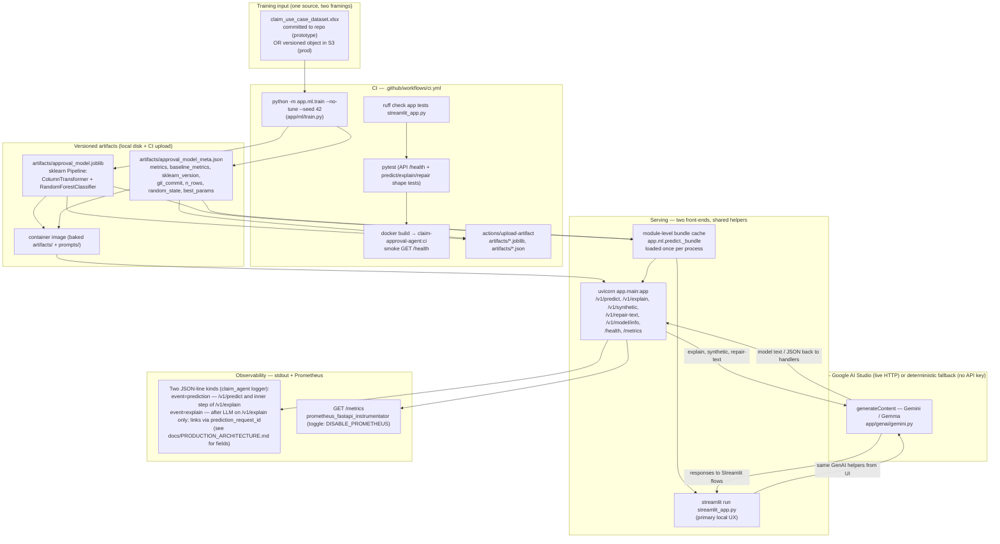
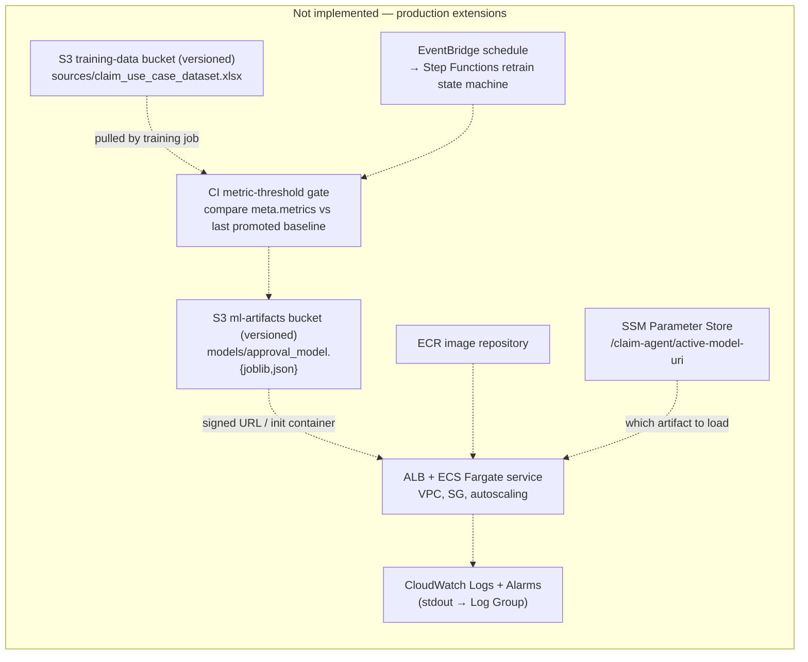

# Design document — GenAI-powered Claim Approval Agent

**Single source of truth for the decisions** behind this prototype: architecture (what is implemented versus what a production shape would add), ML modelling, GenAI prompt strategy, deployment/MLOps, and evaluation/monitoring. Module-specific justifications stay in `docs/FEATURE_ENGINEERING.md`, `docs/AWS_DEPLOYMENT.md`, and `docs/PRODUCTION_ARCHITECTURE.md`. "How to run" lives in [`README.md`](README.md); notebooks under `notebooks/` are the evidence trail.

---

## 1. Architecture

The architecture is split into two diagrams on purpose: **what the repo actually does** and **what you would add to productionise it on AWS**. The previous single diagram mixed the two and carried boxes (a "curated dataset", an automatic metric-threshold gate, an SSM pointer, a prompt-refresh loop) that are not in the code — those have been moved to the production-delta diagram or dropped entirely.

### 1.1 What this repository implements (prototype)



**Dropped vs the old diagram:** `CURATED` (no curation exists), the prompt-refresh arrow (prompts are baked into the image), the SSM pointer (no runtime model-version resolution), and the metric-threshold "release gate" (CI has lint/test/train/Docker smoke only).

### 1.2 What production on AWS would add (delta)



`infra/terraform/main.tf` currently declares **only** the ECR repo, the two S3 buckets (versioned + encrypted + public-access-blocked), and one CloudWatch log group. The gate, SSM pointer, ECS service, ALB, EventBridge, and Step Functions are *described in documentation and intentionally left as placeholders* — see `infra/terraform/README.md`.

### 1.3 Runtime stack at a glance

| Layer | Where it lives | What it does |
|-------|----------------|--------------|
| Data | `app/ml/dataset.py` (`load_claims_training_frame`) | `pd.read_excel` → coerce numerics → derive `approved = (status=="Completed")` → drop label. No curation step. |
| Features | `app/ml/features.py` | `engineer_features` (log1p, ratios, persona rules, `coverage_duration_tier`) + `build_preprocessor` (median impute + `StandardScaler`; `OneHotEncoder(handle_unknown="infrequent_if_exist", max_categories=50)`). |
| Training | `app/ml/train.py` | Stratified split, `RandomForestClassifier(class_weight="balanced_subsample")`, optional `RandomizedSearchCV(scoring="roc_auc", n_iter=18, cv=4)`, always fits a `DummyClassifier(strategy="most_frequent")` baseline, writes bundle + meta JSON. |
| Inference | `app/ml/predict.py` | Module-level `_bundle` cache, `predict_batch`, `top_feature_names`, `model_identity_for_logs`. |
| GenAI | `app/genai/{gemini.py, service.py, text_repair.py, prompt_loader.py}` | **`generate_content` to Google AI Studio when `GEMINI_API_KEY` is set**; same code paths **`/v1/explain`, `/v1/synthetic`, `/v1/repair-text`** fall back to **deterministic local output** when no key so CI and demos stay green. Only **`/v1/explain`** emits the structured **`event=explain`** log; **`synthetic`** and **`repair-text`** rely on generic HTTP/access logging unless extended. |
| API | `app/main.py` | FastAPI + Pydantic (`app/schemas.py`), lifespan loads the bundle, **two structured JSON-line kinds** (`prediction`, `explain` — see `docs/PRODUCTION_ARCHITECTURE.md`), optional Prometheus. |
| UI | `streamlit_app.py` | Same helpers; includes an MLOps tab driven by `app/ml/mlops_sim.py` that reuses the eval-drift CSV as "newly annotated data" for a retrain-compare demo. |

### 1.4 Documentation map and component glossary

| Document | Audience | Content |
|----------|----------|---------|
| **This file (`DESIGN.md`)** | Architecture and product decisions | Prototype vs production delta, ML + GenAI behavior, notebooks, deployment/MLOps principles. |
| **`docs/PRODUCTION_ARCHITECTURE.md`** | Operators / observability | **Exact** structured log fields for `prediction` vs `explain`, diagram tying logs to artifacts and Prometheus. |
| **`docs/AWS_DEPLOYMENT.md`** | AWS rollout | Service choices (Fargate, ALB, S3, ECR), networking, LLM cost controls, Terraform stub vs full stack. |

| Component | One-line role |
|-----------|----------------|
| **Route 53** | DNS to the public hostname (often alias to ALB). |
| **AWS WAF** (optional) | Rate / rule-based protection in front of ALB; useful to throttle expensive LLM routes. |
| **ALB** | HTTPS load balancing and health checks across Fargate tasks. |
| **ECS on Fargate** | Runs the FastAPI container without managing EC2 nodes. |
| **S3 (versioned)** | Durable store for training snapshots, `joblib` + `meta.json`, optional prompt prefixes; rollback by object version. |
| **ECR** | Private container registry; ECS pulls images by digest. |
| **VPC / security groups** | Network isolation; restrict ingress to ALB and egress to S3 + LLM APIs. |
| **VPC endpoints / NAT** | Private or controlled egress from tasks to S3 and Google AI / OpenAI. |
| **CloudWatch Logs** | Centralises **stdout** (structured JSON lines) into a log group; optional subscriptions to Kinesis / OpenSearch. |
| **CloudWatch Metrics / alarms** | Infra and custom alerting (full wiring is production stretch). |
| **SSM Parameter Store** | Production delta: active model URI, non-secret config; often paired with Secrets Manager for API keys. |
| **Prometheus (`GET /metrics`)** | **In-process** request metrics via `prometheus_fastapi_instrumentator`; you run or attach a scraper — not created by the minimal Terraform in this repo. |
| **Google AI Studio `generateContent`** | Live GenAI for explain / synthetic / repair when configured; otherwise the app uses local deterministic outputs. |

---

## 2. Claim approval ML

### 2.1 Problem framing

From `claim_use_case_dataset.xlsx`: **`status == "Completed"` → 1 (approved); `status == "Declined"` → 0**, coded in `load_claims_training_frame`. No other status values. The class prior (~84 % approved on the 2 880-row workbook) matters for every metric choice below.

### 2.2 Evidence-driven features (Notebook 01 → Notebook 02)

Notebook `01_load_and_explore_data` runs χ² / Cramér's V, Pearson correlations, Holm–Bonferroni-corrected pairwise z-tests, and keyword heuristics across every feature family. Notebook `02_feature_engineering` then re-imports `engineer_features` / `build_preprocessor` and asserts the engineered frame lines up with what training consumes. Condensed findings (full tables in NB01 and `docs/FEATURE_ENGINEERING.md`):

| Family | Finding in NB01 | Decision reflected in `app/ml/features.py` |
|--------|-----------------|--------------------------------------------|
| Money (`excessFee`, `rrp`, `balanceRRP`, `oldBalanceRRP`) | `\|Pearson r\| < 0.07` vs label; **binned `rrp`** and **`excessFee` tiers** show χ² p ≈ 5.65e-9 / Cramér's V ≈ 0.124 | Kept raw + `_log1p` variants + ratios `rrp_minus_balance`, `fee_to_rrp` (NaN when `rrp ≤ 0`) |
| `deviceCost` | Zero variance in sample | **Dropped** as informative predictor (column stays for schema compatibility but contributes no signal) |
| Policy duration | Exact-day p ≈ 0.126; **tiered** (`<120d / 6m / 12m / 24m+`) p ≈ 0.005, Cramér's V ≈ 0.066 | Engineered `coverage_duration_tier` as OHE categorical |
| Categoricals | `model` p ≈ 1.76e-6, V ≈ 0.149; `channel`, `coverage`, `claimType`, `retailerName` individually non-significant | All kept inside OHE with `infrequent_if_exist`; high-cardinality `model` (363 distinct) collapsed via `max_categories=50` |
| Symptoms | `touchScreen` p ≈ 7.6e-7; `audio` p ≈ 0.006; others weak individually | Twelve binary flags enter the **numeric** pipeline (so specific combos remain expressible); `symptom_count` added as an explicit aggregate |
| Text | `issueDesc` majority Swedish; 2 884 unique strings translated once to `issueDesc_en` via Gemini and cached in `notebooks/issue_desc_en_cache.json` | Model sees only **length proxies** (`issue_desc_len`, `product_name_len`, `product_desc_len`). Optional `POST /v1/repair-text` rewrites text to English for readability without affecting scores unless reintegrated manually. |

### 2.3 Training and baselines (Notebook 03)

Notebook 03 runs `python -m app.ml.train --no-tune --seed 42` through `subprocess` and then loads `approval_model_meta.json` so the same numbers the CLI printed can be inspected programmatically. Key choices:

- **`RandomForestClassifier(class_weight="balanced_subsample", n_jobs=-1)`** inside a single `Pipeline` with the preprocessor — handles mixed types, nonlinearities, and gives usable probabilities for the risk bands the API needs.
- **Hyperparameter search** `RandomizedSearchCV(n_iter=18, cv=4, scoring="roc_auc")` over `{n_estimators, max_depth, min_samples_leaf, max_features}`. `--no-tune` skips it for CI speed.
- **Baseline**: `DummyClassifier(strategy="most_frequent")` is **always** trained and logged. This is the no-skill comparator the problem statement demands transparency on.

#### 2.4 Honest metric read-out

Current checked-in meta (`artifacts/approval_model_meta.json`, `--no-tune`, seed 42):

| Metric | Model | `DummyClassifier(most_frequent)` |
|--------|------:|---------------------------------:|
| ROC-AUC | **0.558** | 0.500 |
| Accuracy | 0.842 | 0.842 |
| Binary F1 | 0.912 | 0.914 |

Interpretation, stated plainly: **the random forest is only marginally above the no-skill baseline**. Accuracy and F1 look good solely because ~84 % of rows are approved — a blanket-approve stub gets the same numbers. ROC-AUC is the honest summary. NB01 flagged small individual effect sizes for most features; this is the consequence. The design choice is to keep the pipeline, tuning, baseline, and metadata in place **so that `06_evaluation_and_monitoring` and the MLOps tab in Streamlit have a real artifact to interrogate** — not to pretend the model is strong. Improvements (gradient boosting, TF-IDF / embedding on `issueDesc_en`, calibration, slice metrics, SHAP per row) are enumerated in `docs/FEATURE_ENGINEERING.md`.

---

## 3. Generative AI

### 3.1 Multi-persona explanations — `/v1/explain` + Notebook 04

Prompt strategy in three layers, assembled in `app/genai/service.py::explain_personas`:

1. **Global system prompt** `prompts/explain_system.txt` — "ground every statement in the supplied JSON, do not invent statutes/amounts, refuse to speculate about coverage you were not given". Identical for every persona.
2. **Persona conditioner** — one of eight `prompts/explain_<persona>_prefix.txt` files (customer, claims adjuster, high/low-value insured, small-issue, end-of-duration, theft, repeat). Prefix owns tone and what each persona is legally and operationally allowed to see.
3. **Grounded payload** (JSON, not free prose): the full `ClaimInput.model_dump(mode="json")`, the `{approved, probability_approved, risk_band}` decision envelope, and `top_features` from `top_feature_names(8)` — global RF importances, not per-row SHAP (a documented limitation).

Concurrency: `asyncio.gather` fires persona calls in parallel when `GEMINI_RPM` is unset; with `GEMINI_RPM` set the client-side spacer in `app/genai/gemini.py` serialises *starts* to match the tier. **With `GEMINI_API_KEY` set, calls go to Google AI Studio.** When no API key is configured, `_stub()` emits persona-aware **deterministic** text so Streamlit and the test suite stay green **without billing the vendor**.

### 3.2 Targeted synthetic scenarios — `/v1/synthetic` + Notebook 05

Notebook 05 formalises the targeting step. Crucially, the raw workbook records *decisions* (`approved`), **not** an internal probability; the notebook computes one by re-scoring every row with the trained pipeline (`predict_batch(df)` in §1a), attaches the vector as `probability_approved` in-memory, and then cross-tabulates:

```
claimType × coverage × channel × fee_to_rrp tertile × coverage_duration_tier
```

with per-cell counts `n_total / n_decl / n_border`, `decline_rate`, `lift_decl`, and Pearson residual. Three tables are sliced from the grid and written to `data/pattern_strata_denial_borderline.csv`:

- **Table A — rare declines** (`n_decl ≥ 1`, `n_total ≥ MIN_CELL_SUPPORT=10`, sort `n_decl↑`, head 14).
- **Table B — rare RF-borderline-density** (`n_border ≥ 1`, sort `n_border↑`, head 14; border band `[0.40, 0.60]` by analyst choice — NB05 prints quantiles and share-in-band for calibration).
- **Table C — high `lift_decl`** (`n_decl ≥ 5`, sort `lift_decl↓`, head 8).

These slices are pasted verbatim into the Gemini prompt so the model can see *how sparse* each cell is. The §2 cell in the notebook prints the exact prompt before sending so every run is auditable. `app.ml.persona_labels.PERSONA_CANONICAL` is also injected so the model uses the project's canonical persona strings rather than inventing labels. The notebook itself includes a **Caveats** section that states plainly why RF-guided synthesis can amplify the model's own blind spots — this is called out in the design because it matters more than the generator itself.

`POST /v1/synthetic` (`app/genai/service.py::generate_synthetic_json`) is the operational sibling: it takes `{n_scenarios, focus=denial_patterns|borderline, deny_rate_hint, narrative_words_max}`, loads `prompts/synthetic_generation.txt`, forces JSON-array output, and falls back to deterministic vignettes (with the error attached) if the LLM returns non-JSON or errors — the fallback path matters for demo reliability.

### 3.3 Text repair — `/v1/repair-text`

Kept deliberately orthogonal to scoring. `app/genai/text_repair.py` does deterministic Latin-1 mojibake reversal + NFKC + whitespace collapse (same helpers as `app/ml/text_clean.py`), then, **only if** `GEMINI_API_KEY` is set, calls Gemini with `prompts/text_repair.txt` to rewrite to English as JSON. Because the repaired text is not re-fed into `predict_batch` automatically, scores stay deterministic unless the operator chooses to paste repaired strings back into a claim. This is the "silent-score-change" trap acknowledged and avoided.

### 3.4 Service choice and cost

Primary LLM: **Google AI Studio `generateContent`** (the Gemini / hosted-Gemma endpoint) via one thin wrapper in `app/genai/gemini.py`. A legacy OpenAI-compatible path exists in `app/genai/service.py` but only activates when no Gemini key is set. Rate control: `GEMINI_RPM` (or explicit `GEMINI_MIN_REQUEST_INTERVAL_S`) serialises starts; the eval script `scratch/generate_eval_logs_genai.py` additionally derives an `explain` batch size from `EVAL_GEMINI_RPD_BUDGET` / `EVAL_EXPLAIN_BATCH_MAX`. 503s are retried with exponential backoff.

---

## 4. Deployment and MLOps / LLMOps

### 4.1 AWS service choices (and why)

| Concern | Pattern | Rationale |
|---------|---------|-----------|
| Online API | **ECS Fargate + ALB** | Same long-lived Uvicorn process as dev; avoids Lambda payload/cold-start pain for wide claim JSON and parallel persona calls |
| Images | **ECR** | Immutable digests; pair each release with the model-meta JSON git SHA for lineage |
| Artifacts | **S3 versioning on** | Rollback for `joblib + meta.json + prompts/`; the Terraform stub declares the bucket with versioning + server-side encryption + public-access block |
| Secrets | **SSM / Secrets Manager** | `GEMINI_API_KEY`, future DB URLs; mounted as task env |
| IaC | **Terraform** (`infra/terraform/main.tf`) | Currently declares ECR, two versioned encrypted S3 buckets, and a CloudWatch log group. ECS service, ALB, VPC, and SSM parameter are intentionally stubbed (see `infra/terraform/README.md`) |

Alternatives (see `docs/AWS_DEPLOYMENT.md`): **App Runner** for the simplest "public HTTPS from a repo" path; **Lambda + container** for spiky minimal scale; **SageMaker** if training migrates off GitHub Actions.

### 4.2 CI/CD (what is actually implemented)

`.github/workflows/ci.yml`, on every push/PR:

1. Install deps + editable package.
2. Assert `claim_use_case_dataset.xlsx` is present; run `python -m app.ml.train --no-tune --seed 42`.
3. `ruff check app streamlit_app.py tests`.
4. `python -m py_compile streamlit_app.py` (import-only smoke, no headless Streamlit).
5. `pytest -q` with `DISABLE_PROMETHEUS=1`.
6. `actions/upload-artifact` — `artifacts/*.joblib` + `artifacts/*.json` as workflow artifacts keyed by `github.sha`.
7. `docker/build-push-action@v6` (`push: false`, `load: true`) to produce `claim-approval-agent:ci`, then `curl -fsS /health` against the container.

Deliberately **not** in CI yet (each would live next to step 6): metric-threshold comparison vs the last promoted `approval_model_meta.json`, `docker push` to ECR, `aws s3 cp` of artifacts, SSM parameter update, and a canary/shadow deploy step. The diagrams in §1 mark these aspirations with dashed arrows.

### 4.3 Versioning

- **Models**: `approval_model_meta.json` records `trained_at`, `git_commit`, `sklearn_version`, `n_rows`, `random_state`, `best_params`, `metrics`, `baseline_metrics`. `model_identity_for_logs()` copies a subset of these fields onto **every** structured log line so traffic can be joined to the exact artifact that served it.
- **Prompts**: plain `.txt` files under `prompts/`, reviewed in git; `/v1/model/info` lists them at runtime. For a production release, tag the repo when prompt semantics change and, optionally, `aws s3 sync prompts/ s3://.../prompts/<release>/`.

---

## 5. Evaluation, monitoring, responsible AI

### 5.1 Notebook 06 — offline evaluation harness

Notebook 06 is organised as a deployment *timeline*, matching what you would monitor in production:

1. **T0 — ground-truth baseline.** Read the exact `metrics` block from `approval_model_meta.json` instead of recomputing. This guarantees we compare live traffic to the same artifact that serves it.
2. **T1 — live traffic drift.** Generate two CSVs (`data/eval_historical_logs.csv`, `data/eval_drift_logs.csv`) via `scratch/generate_eval_logs_genai.py`. The "live" window deliberately inflates `rrp` / `excessFee` on a subset so there is a real distribution shift to visualise. Feature drift (KDE over `claim_amount`), GenAI drift proxy (customer-explanation length KDE), and prediction-rate drift are shown side by side.
3. **GenAI divergence.** `calculate_hallucination_rate` in NB06 vectorises `reference_explanation` and each persona's text with TF-IDF, flags rows with cosine < 0.8 as "divergent", and alarms when the live share of divergent rows exceeds 15 %. Not a semantic oracle — a cheap tripwire that catches refusal spikes and off-topic drift.
4. **T2 — retrain flow.** Written out as a numbered sequence (data segmentation → trigger `python -m app.ml.train` on the augmented set → new `approval_model_meta.json` → A/B or shadow → promote if ROC-AUC/F1 improve → reset the drift baseline). The Streamlit MLOps tab runs a miniature version of this comparison in-memory through `app.ml.mlops_sim.compare_retrain_holdout`.
5. **Golden set / canary.** A handful of expected claim-ID predictions + reference explanations are injected into traffic and checked; mismatches page out. Lets you catch LLM-provider regressions that neither ROC-AUC nor feature drift will catch.

### 5.2 Production parity

FastAPI emits **two** JSON-line event kinds through the standard logger (`claim_agent`): `event=prediction` (every `/v1/predict` + the predict step inside `/v1/explain`) and `event=explain` (LLM outcomes on **`/v1/explain` only**, with `prediction_request_id` linking back). **`/v1/synthetic`** and **`/v1/repair-text`** use GenAI but **do not** emit these structured events unless you extend `app/main.py`. Both `prediction` and `explain` lines carry the **same** model-correlation fields from `model_identity_for_logs()`: `model_trained_at`, `model_git_commit`, `model_sklearn_version`, `model_train_n_rows`, `model_train_random_state`, `model_artifact_path`. In a containerised AWS runtime these go straight to CloudWatch; locally they go to stdout. See `docs/PRODUCTION_ARCHITECTURE.md` for field-by-field tables and join semantics.

The notebook CSVs are the offline analogue of these events with extra columns (both persona explanations, reference explanation, ground-truth approval) that you do not want inside a production log line.

### 5.3 Metrics to watch

| Domain | Metric |
|--------|--------|
| ML | ROC-AUC (primary), accuracy / F1 only alongside the baseline numbers, slice metrics by `country` / `coverage_duration_tier` / `model`, PSI on `probability_approved` vs the training-time baseline |
| GenAI | TF-IDF divergence per persona (NB06), JSON-parse failure rate on `/v1/synthetic`, Gemini 429 / 503 rate, p95 explain latency, refusal spikes |
| System | p95 request latency, 5xx count, container CPU / memory, LLM spend dollars per 1k requests |

### 5.4 Responsible AI

- **Transparency.** Every narrative is grounded in `{approved, probability_approved, risk_band, top_features}`; the system prompt forbids invented statutes/amounts; customer persona copy carries an explicit "modelled guidance, not a binding decision" disclaimer.
- **Fairness.** Slice-metric hooks are called out in §5.3 but not yet alarmed on — this prototype exists for explanation demos, not autonomous adjudication.
- **Human in the loop.** Adjuster persona prefix explicitly prompts for fraud/heuristic follow-up actions; synthetic and repair paths do not silently mutate claims.

---

## 6. Assumptions and alternatives

| Assumption | Alternative for a real deployment |
|------------|------------------------------------|
| Single workbook snapshot in the repo | Warehouse export with partition keys; Delta/Iceberg for incremental retrains |
| Gemini as hosted LLM | Amazon Bedrock, Azure OpenAI, on-prem — swap the `generate_content` wrapper; keep the prompt files |
| Global feature importances for persona explanations | `shap.TreeExplainer` for per-claim attributions if audit requires it |
| JSON-on-disk model metadata | MLflow / Vertex Model Registry + URI inside `approval_model_meta.json` |
| Terraform stub with ECR + S3 + log group only | Full VPC + ECS service + ALB + SSM + EventBridge + Step Functions; or a managed pattern such as App Runner |

---

## 7. Notebook index (evidence trail)

| Notebook | Role |
|----------|------|
| `01_load_and_explore_data` | EDA, statistical associations, `issueDesc` translation, keyword heuristics |
| `02_feature_engineering` | Re-imports `engineer_features` / `build_preprocessor`, asserts column order, shows `ColumnTransformer` output shape |
| `03_train_model` | Runs the CLI via `subprocess`, inspects `approval_model_meta.json` + baseline block |
| `04_inference_and_genai` | `predict_batch`, `top_feature_names`, `explain_personas(customer, claims_adjuster)` with top-level `await` |
| `05_mock_incremental_data` | Strata grid, three sparse/hot tables, RF-border band, prompt-with-injected-tables call to Gemini, outputs `data/synthetic_incremental_last_run.csv` |
| `06_evaluation_and_monitoring` | Baseline-from-meta, feature + prediction + GenAI drift, canary/golden-set, retrain flow narrative |

Regenerate notebooks 01–04 from the scripted emitter after code changes: `python scripts/emit_pipeline_notebooks.py`.

---

## 8. Implemented vs stretch — a final accounting

| Item | Status |
|------|--------|
| Feature engineering + `RandomForestClassifier` + baseline comparator + metadata JSON | Implemented |
| `RandomizedSearchCV` on ROC-AUC (opt-in via default `train()` call, opt-out with `--no-tune`) | Implemented |
| Multi-persona explanation (8 personas) with grounded prompts + deterministic no-key fallback | Implemented |
| Targeted synthetic scenarios (notebook + API endpoint) | Implemented |
| Text repair endpoint (deterministic + optional Gemini rewrite) | Implemented |
| FastAPI + Streamlit + Docker + CI (train, lint, test, build, health smoke) | Implemented |
| Structured JSON-line prediction/explain logs with model-lineage correlation | Implemented |
| Prometheus `/metrics` (opt-out via `DISABLE_PROMETHEUS`) | Implemented |
| Terraform: ECR + versioned/encrypted S3 buckets + CloudWatch log group | Implemented |
| Metric-threshold release gate in CI; ECR push; S3 artifact upload; SSM active-model pointer | Documented, not wired |
| Full VPC + ECS service + ALB; EventBridge → Step Functions retrain | Documented, not wired |
| Per-claim SHAP; MLflow registry; automated drift alarms | Documented, not wired |

---

*The model's ROC-AUC (0.558) is deliberately transparent: the challenge asks for thought process over leaderboard performance, and the entire pipeline — CI, artifacts, logs, eval harness, responsible-AI hooks — is built to make that honest read-out visible rather than hidden.*
