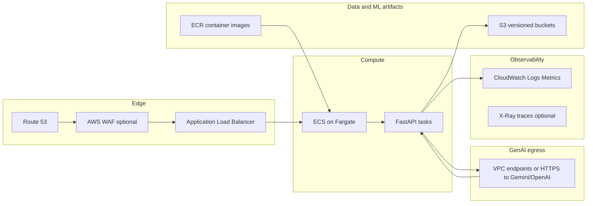

# AWS deployment sketch — Claim Approval Agent

This document outlines a pragmatic AWS layout for the integrated **ML prediction** (scikit-learn) and **GenAI** (Gemini / OpenAI-compatible) REST service, aligned with typical MLOps/LLMOps concerns: versioning, scalability, observability, and controlled LLM spend.

## Architecture (high level)

**GenAI egress is request/response:** tasks open HTTPS to Google AI (or OpenAI-compatible paths in code); model output returns to the same FastAPI handlers that serve **`POST /v1/explain`**, **`POST /v1/synthetic`**, and **`POST /v1/repair-text`**.

## Diagram components (quick reference)

| Component | Role |
|-----------|------|
| **Route 53** | DNS name → ALB (or other target). |
| **AWS WAF** (optional) | Web ACL in front of ALB; rate-based rules help cap abuse of LLM-heavy routes. |
| **ALB** | TLS termination, routing, health checks; spreads traffic across Fargate tasks. |
| **ECS on Fargate** | Runs the API container (same Uvicorn process as local); no EC2 fleet to patch for a prototype. |
| **FastAPI tasks** | `uvicorn app.main:app`; serves `/v1/*`, `/health`, `/metrics`. |
| **S3 (versioned buckets)** | Training snapshots, `approval_model.{joblib,json}`, optional prompt prefixes; object versioning for rollback. |
| **ECR** | Stores immutable container images; ECS pulls by digest/tag. |
| **VPC endpoints / HTTPS egress** | Private or controlled path from tasks to S3 and to LLM vendor APIs (compliance-dependent). |
| **CloudWatch Logs / Metrics** | Centralised logs from task stdout; metrics/alarms for ops (full alarm set is deploy-specific). |
| **X-Ray** (optional) | Distributed tracing — not required for the minimal sketch. |
| **Prometheus** | **Not an AWS box in this diagram:** the app exposes **`GET /metrics`** for a scraper; see `docs/PRODUCTION_ARCHITECTURE.md`. |

## How this doc fits with `DESIGN.md` and `PRODUCTION_ARCHITECTURE.md`

| Doc | Focus |
|-----|--------|
| [`DESIGN.md`](../DESIGN.md) | Single source of truth: prototype vs prod delta, ML, GenAI prompts, CI, evaluation. |
| [`PRODUCTION_ARCHITECTURE.md`](PRODUCTION_ARCHITECTURE.md) | **Structured logs** (`prediction` / `explain`), join keys, model lineage fields, Prometheus vs CloudWatch. |
| **This file** | **AWS-specific** layout: why Fargate + ALB, buckets, networking, LLM spend controls. |

## REST API (already implemented)

The service is a **FastAPI** app (`app/main.py`) with:

| Endpoint | Purpose |
|----------|---------|
| `GET /health` | Liveness |
| `POST /v1/predict` | ML approval probability |
| `POST /v1/explain` | Persona explanations (LLM) |
| `POST /v1/synthetic` | Synthetic stress scenarios (LLM) |
| `POST /v1/repair-text` | Text cleanup / optional LLM rewrite |
| `GET /v1/model/info` | Model metadata and prompt file list |
| `GET /metrics` | Prometheus metrics (when enabled) |

Structured JSON lines (`event=prediction` / `event=explain`) are emitted only from **`/v1/predict`** and **`/v1/explain`**; see [`PRODUCTION_ARCHITECTURE.md`](PRODUCTION_ARCHITECTURE.md).

Container entrypoint: `uvicorn app.main:app --host 0.0.0.0 --port 8000` (see root `Dockerfile`).

## AWS service choices (and why)

### Compute: **Amazon ECS on Fargate** (preferred for this prototype)

- **Why not Lambda alone**: request bodies include wide claim JSON; cold starts and payload limits are awkward for bursty batch explain workloads. Fargate runs the same long-lived Uvicorn process as local dev.
- **Why Fargate vs EC2**: no instance patching toil for a prototype; autoscaling on CPU/RAM/ALB request count is straightforward. **Cost**: pay per vCPU/RAM-second; keep `min_capacity` small in non-prod.
- **Alternative**: **AWS App Runner** for the simplest path (build from ECR, HTTPS included) if you do not need a private VPC immediately.

### Storage: **Amazon S3 (versioning on)** + **Amazon ECR**

- **S3**: store **versioned** training snapshots (`claim_use_case_dataset.xlsx` refreshes), exported `approval_model.joblib` + `approval_model_meta.json`, and prompt templates under a prefix such as `s3://…/prompts/v2025-04-29/`. Enables rollback and audit.
- **ECR**: immutable **image digests** per release; tag `latest` only for dev. Pair image version with model version in `approval_model_meta.json`.

### Networking: **ALB + VPC**

- **Application Load Balancer** in public subnets, targets on Fargate in private subnets.
- **Security groups**: ALB `443 →` tasks `8000`; tasks **egress only** to Gemini/OpenAI endpoints (and S3 via VPC endpoint or NAT, depending on compliance).
- **AWS WAF** (optional) for rate-based rules on `/v1/explain` and `/v1/synthetic` to cap **LLM cost** abuse.

### LLM inference cost control

- Route heavy endpoints behind **separate target group** or **higher throttling** in API Gateway (if used in front of ALB).
- Use **Gemini Flash** (default in `app/config.py`) for cost-sensitive paths; reserve larger models only for offline eval.
- Log **token estimates** and latency in structured JSON (already partially done for `/v1/explain`); export to **CloudWatch Logs Insights** or **OpenSearch** for cost dashboards.

## MLOps / LLMOps practices (how they map here)

| Principle | Application |
|-----------|----------------|
| **IaC** | Define VPC, ECS service, ALB, S3 buckets with **Terraform** or **AWS CDK** (`infra/terraform` holds a minimal stub). Same stack names per env (`dev`/`staging`/`prod`). |
| **CI/CD for models and prompts** | GitHub Actions trains on committed Excel (see `.github/workflows/ci.yml`), runs tests, and can **upload artifacts** as workflow artifacts. Promote the same **image digest + S3 artifact hash** to staging before prod. |
| **Model versioning** | `artifacts/approval_model_meta.json` records training seed, metric, timestamp; ECS task definition env `MODEL_VERSION` can mirror Git SHA. |
| **Prompt versioning** | Prompts live under `prompts/`; `/v1/model/info` lists files. Tag releases when prompt semantics change; optional S3 sync in deploy pipeline. |
| **Monitoring drift** | **Offline**: periodic batch job (Glue job or scheduled ECS task) scores a holdout and compares distribution of `probability_approved` vs baseline (**Evidently**, custom stats, or SageMaker Clarify for deeper work). |
| **LLM output quality** | Log sample explanations with hashed claim IDs; optional **human rating** webhook; alert on spike in refusal rate from Gemini or JSON parse failures (`502` paths in `/v1/synthetic`). |

## Minimal implementation in this repo

- **Docker**: `Dockerfile` + `.dockerignore` for reproducible runtime with baked `artifacts/`.
- **CI**: workflow trains from `claim_use_case_dataset.xlsx`, lints, tests, and uploads `artifacts/` as a **workflow artifact** (see `.github/workflows/ci.yml`).
- **Metrics**: `GET /metrics` when Prometheus instrumentator loads (toggle with env `DISABLE_PROMETHEUS`).

Extend with Terraform-managed ECS services and Parameter Store secrets (`GEMINI_API_KEY`) for a production-hardened path.
