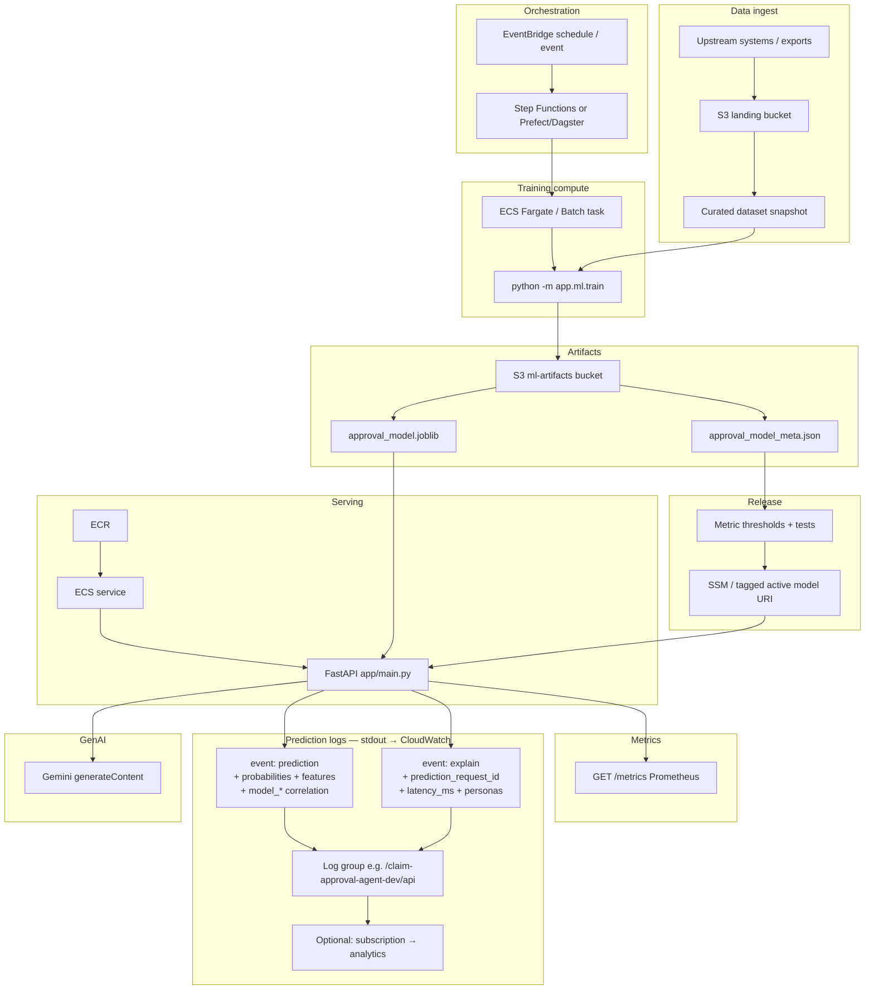

# Production architecture

End-to-end production flow with **structured prediction logs** (no notebooks). Inference emits JSON lines suitable for CloudWatch Logs or any log drain.

## Prediction log events

Emitted by `app/main.py` via the standard logger (`claim_agent`), one JSON object per line:

| `event`       | When                         | Correlation |
|---------------|------------------------------|-------------|
| `prediction`  | Every `/v1/predict` and each `/v1/explain` (explain runs predict first) | `request_id` |
| `explain`     | After LLM explanations on `/v1/explain` only | `prediction_request_id` → matching `prediction.request_id`; own `request_id` |

**Prediction payload** includes: `ts`, `request_id`, `claim_id`, `prediction_approved`, `probability_approved`, `probability_declined`, `risk_band`, `features`, `top_features`, plus **model correlation** from the loaded bundle (`model_trained_at`, `model_git_commit`, `model_sklearn_version`, `model_train_n_rows`, `model_train_random_state`, `model_artifact_path`).

**Explain payload** adds: `latency_ms`, `personas`, `claim_id`, and the same model correlation fields.

## Diagram

