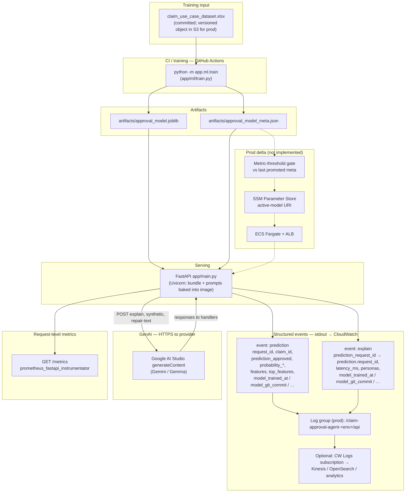

# Production architecture — structured logs zoom

This document is the **zoom-in on runtime observability**. For the full architecture split (what is implemented versus what production on AWS would add), see [`../DESIGN.md`](../DESIGN.md) §1. For AWS service choices and networking, see [`AWS_DEPLOYMENT.md`](AWS_DEPLOYMENT.md). This file spells out **`event=prediction` vs `event=explain`**, how they correlate, and where they go at runtime.

## How this differs from other docs

| Doc | Scope |
|-----|--------|
| [`DESIGN.md`](../DESIGN.md) | Canonical architecture, ML + GenAI behavior, notebooks, CI. |
| [`AWS_DEPLOYMENT.md`](AWS_DEPLOYMENT.md) | Fargate, ALB, S3, ECR, cost control, Terraform stub vs full stack. |
| **This file** | **Structured JSON logs**, model-lineage fields, Prometheus hook, observability-focused diagram.

## Structured log events (`prediction` and `explain`)

Both events are produced by `app/main.py` via `logging.getLogger("claim_agent").info(json.dumps(payload))`. **One JSON object per line**. Locally this is **stdout**; on AWS this is collected into [**CloudWatch Logs**](https://docs.aws.amazon.com/AmazonCloudWatch/latest/logs/WhatIsCloudWatchLogs.html) (log group naming is environment-specific; the Terraform stub uses a single group — see `infra/terraform/main.tf`).

**Important:** Only **`/v1/predict`** and **`/v1/explain`** emit these JSON events today. **`/v1/synthetic`** and **`/v1/repair-text`** call GenAI but do **not** write `event=explain` or an extra `event=prediction`; treat them under normal HTTP / access logs unless you extend `app/main.py`.

### Which HTTP routes emit which events?

| HTTP route | `event=prediction` | `event=explain` | Notes |
|------------|:---:|:---:|-------|
| `POST /v1/predict` | Once per request | — | `request_id` is unique to that prediction row. |
| `POST /v1/explain` | Once **before** the LLM (inner `_predict_response`) | Once **after** the LLM | **Two lines per successful explain.** Use `prediction_request_id` on the explain line to find the sibling prediction line (`prediction.request_id` equals that UUID). |

### Correlation identifiers

| Field | On `prediction` | On `explain` |
|-------|-----------------|--------------|
| `request_id` | UUID for **this** prediction log line | **New** UUID for the explain log line (not the same as prediction’s) |
| `prediction_request_id` | — | **Must match** the `request_id` of the `prediction` line produced in the same `/v1/explain` call |
| `claim_id` | From `claim.claimId` (or `"unknown"`) | Same |

### `event=prediction` payload (field reference)

Emitted by `_emit_prediction_log()` in `app/main.py`:

| Field | Meaning |
|-------|---------|
| `event` | Always `"prediction"`. |
| `ts` | ISO 8601 timestamp (UTC). |
| `request_id` | Prediction row id — **tie-breaker** when joining to `explain.prediction_request_id`. |
| `claim_id` | Claim identifier from the submitted body. |
| `prediction_approved` | Boolean model decision. |
| `probability_approved` | Float in `[0, 1]`. |
| `probability_declined` | `1 - probability_approved` in current code. |
| `risk_band` | One of `likely_approve`, `lean_approve`, `borderline`, `lean_decline`, `likely_decline`. |
| `features` | Full claim as JSON (`ClaimInput.model_dump(mode="json")`). |
| `top_features` | List of `{name, importance}` from `top_feature_names(8)`. |
| `model_*` | From `model_identity_for_logs()` — see below. |

### `event=explain` payload (field reference)

Emitted at the end of `POST /v1/explain` after `explain_personas` returns:

| Field | Meaning |
|-------|---------|
| `event` | Always `"explain"`. |
| `ts` | ISO 8601 timestamp (UTC). |
| `request_id` | Id for **this log line** (differs from the paired prediction’s `request_id`). |
| `prediction_request_id` | **Join key** to the inner `prediction` line from the same request. |
| `claim_id` | Same as prediction row for that call. |
| `latency_ms` | Wall time for the **LLM step only** (not model inference). |
| `personas` | List of persona enum values requested. |
| `model_*` | Same lineage block as on `prediction` (see below). |

**Not in the log line:** persona explanation **text** stays in the **HTTP response body** only — it is omitted from logs to bound volume and avoid storing customer-facing prose in compliance-sensitive sinks.

### Model lineage on every structured line (`model_*`)

Both events spread **`model_identity_for_logs()`** from `app/ml/predict.py` (subset of `approval_model_meta.json`), e.g.:

- `model_trained_at`, `model_git_commit`, `model_sklearn_version`, `model_train_n_rows`, `model_train_random_state`, `model_artifact_path`

Use these to slice traffic by **exact artifact** without relying on redeploy guesses.

### Prometheus (`GET /metrics`)

**Implementation is in-process**, not extra AWS infra in this repo: `prometheus_fastapi_instrumentator` mounts **`GET /metrics`** on the FastAPI app when Prometheus is enabled. Disable with env **`DISABLE_PROMETHEUS=1`** (used in CI). A Prometheus Server / Agent **scrapes** that HTTP endpoint — it is **not** the same subsystem as CloudWatch Logs.

## Diagram

GenAI is **not** a dead-end box: **`/v1/explain`**, **`/v1/synthetic`**, and **`/v1/repair-text`** call out; only **`/v1/explain`** produces the **`event=explain`** structured line paired with **`event=prediction`**.

The boxes inside `prod` are **not** implemented in this repository (see `infra/terraform/main.tf` — it declares only ECR, two versioned + encrypted S3 buckets, and the CloudWatch log group). They use dashed arrows. The two structured log kinds, lineage fields on both, **`GET /metrics`**, and the GenAI return path **are** implemented.

## Diagram + runtime glossary

| Term | Meaning here |
|------|----------------|
| **Metric-threshold gate** | Planned CI/deploy check: compare new `approval_model_meta.json` metrics to the last promoted baseline before shipping artifacts — **documented**, not wired. |
| **SSM active-model URI** | Planned Parameter Store pointer to the S3 object (or bundle) ECS tasks should load — **documented**, not wired (prototype reads baked `artifacts/`). |
| **ECS Fargate + ALB** | Where the **FastAPI container** runs in prod; tasks **pull** persisted `joblib` / meta via URI / bake — Fargate does not “store” the model, it serves it. |
| **CloudWatch Logs** | Managed log sink: container **stdout/stderr** → log streams; enables Insights, alarms, subscriptions. |
| **Prometheus** | OSS metrics model; this app exposes a **scrapable** `/metrics` handler (see above). |
